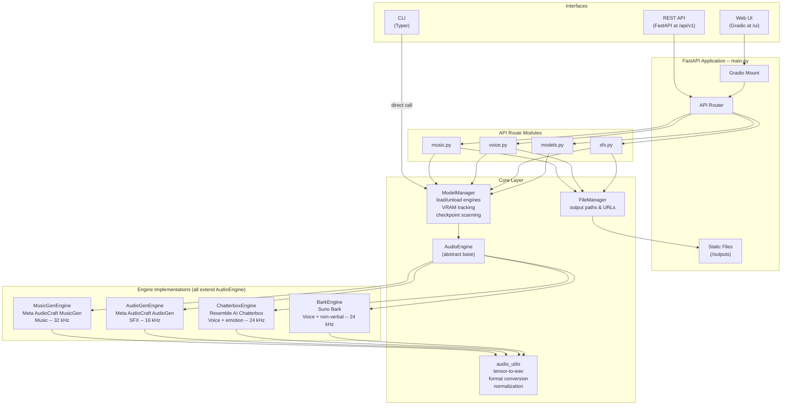
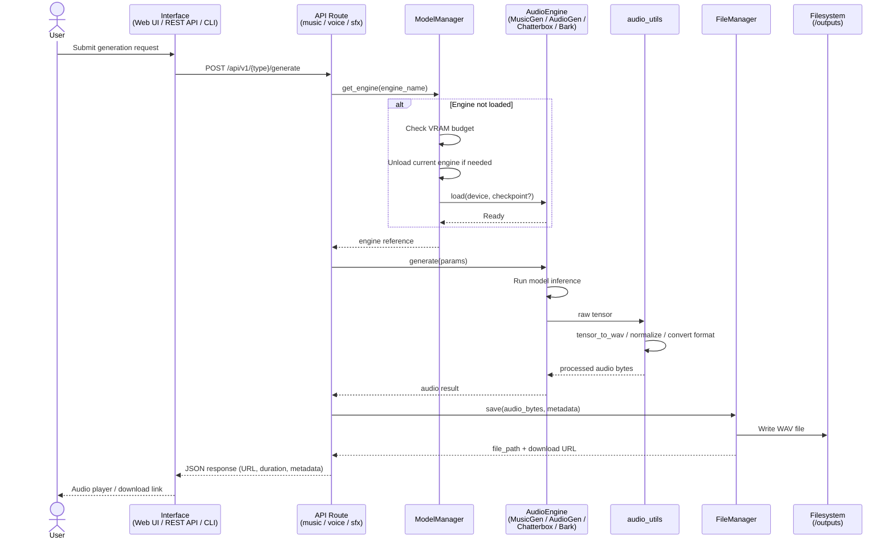
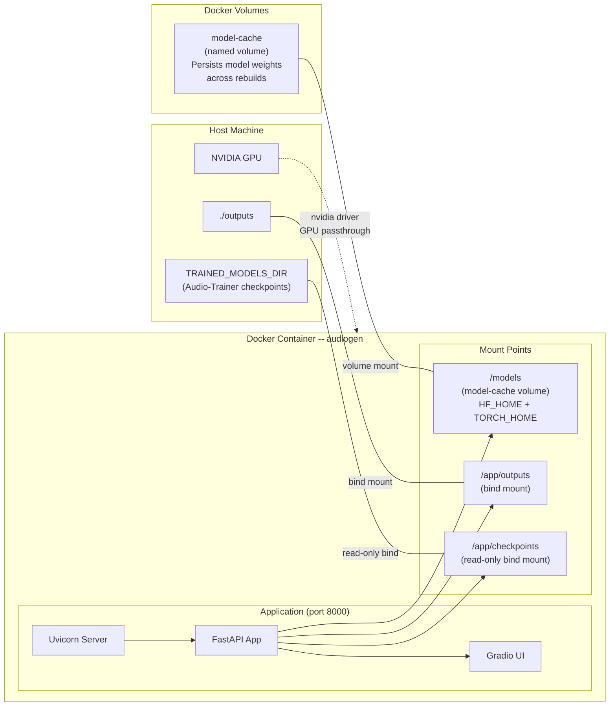

# Audio Generator -- Architecture

## 1. High-Level Architecture

Shows the three user-facing interfaces, the FastAPI application layer, core
services, and the engine implementations that perform actual audio generation.

## 2. Request Flow

Traces a single generation request (e.g. music) from the moment a user submits
it through the interface, into the API route, through the core layer, into the
engine, and back out as a downloadable audio file.

## 3. Docker Container Diagram

Shows the single-container deployment, GPU passthrough, and the three volumes
used for model weights, generated outputs, and trained checkpoints from
Audio-Trainer.

